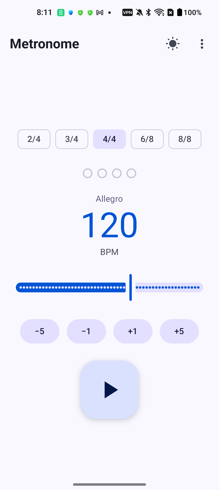
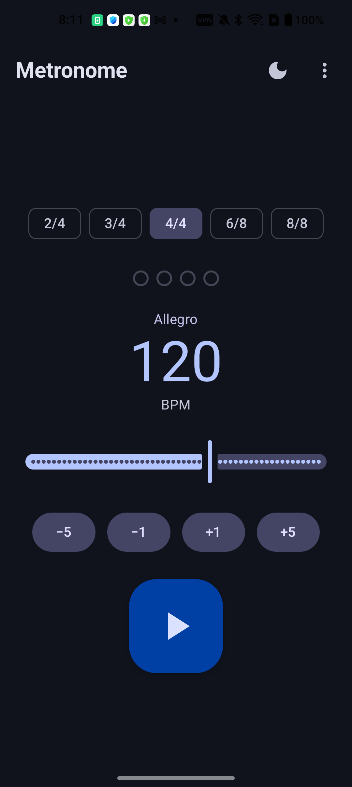

# Metronome

A precise, sample-accurate metronome for Android — built with Kotlin and Jetpack Compose.

<p align="center">
  
  &nbsp;&nbsp;
  
</p>

## Features

- **Sample-accurate audio engine** — synthesized clicks via `AudioTrack` (44.1 kHz, 16-bit PCM) with accented first beats (1200 Hz) and normal beats (800 Hz)
- **BPM range 20–300** — adjust with ±1/±5 buttons, a slider, or direct text input
- **Time signatures** — 2/4, 3/4, 4/4, 6/8, 8/8
- **Visual beat indicator** — highlights the current beat in the measure
- **Tempo markings** — displays labels like *Allegro*, *Andante*, etc.
- **Dark / Light theme** — toggle from the top bar; defaults to system preference
- **Screen stays on** while the metronome is playing
- **About & Licenses** — view app info, source link, and third-party licenses

## Tech Stack

| | |
|---|---|
| **Language** | Kotlin |
| **UI** | Jetpack Compose · Material 3 |
| **Audio** | `AudioTrack` (MODE_STREAM, mono 16-bit PCM @ 44.1 kHz) |
| **Architecture** | ViewModel + StateFlow |
| **Min SDK** | 29 (Android 10) |
| **Target SDK** | 36 |
| **Build** | Gradle (Kotlin DSL) · AGP 9 |

## Build

```bash
# Debug APK
./gradlew assembleDebug

# Release AAB (Play Store)
./gradlew bundleRelease

# Run unit tests
./gradlew test
```

## License

See the in-app licenses screen for third-party library attributions.
